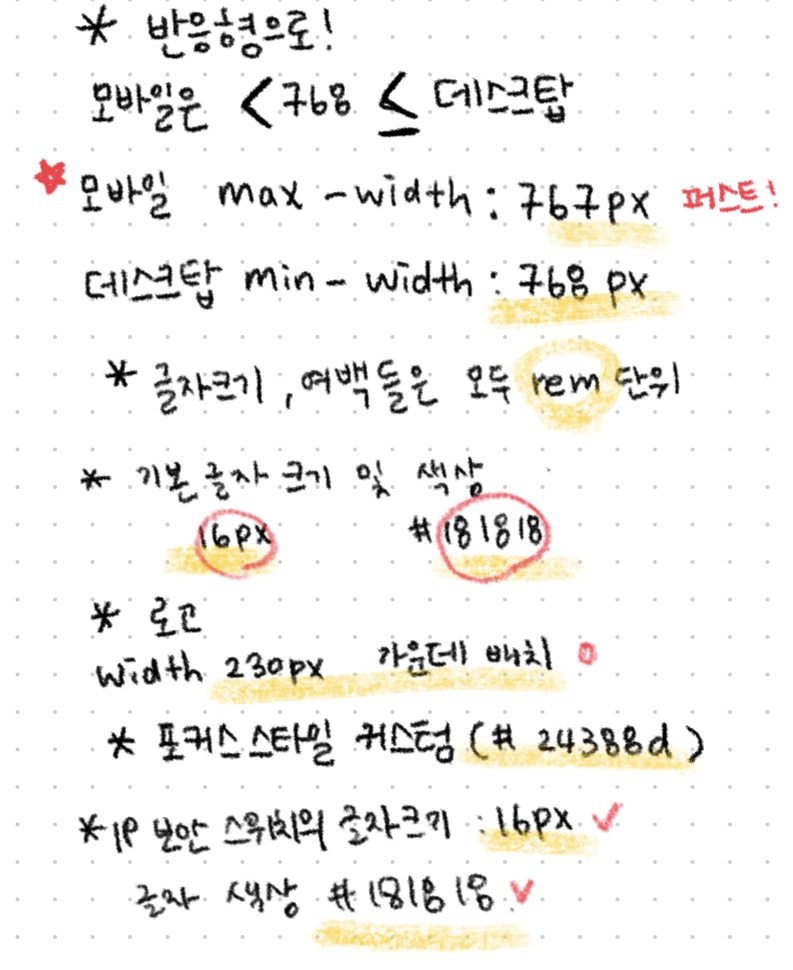
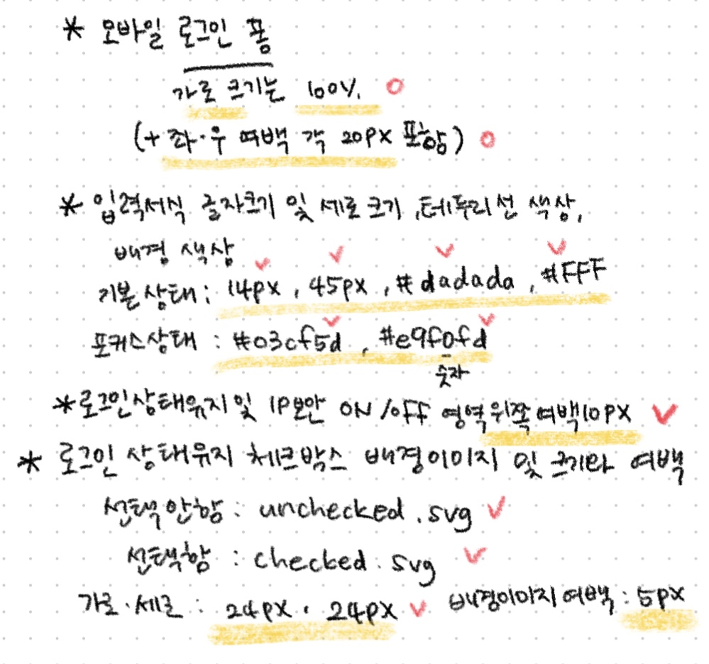
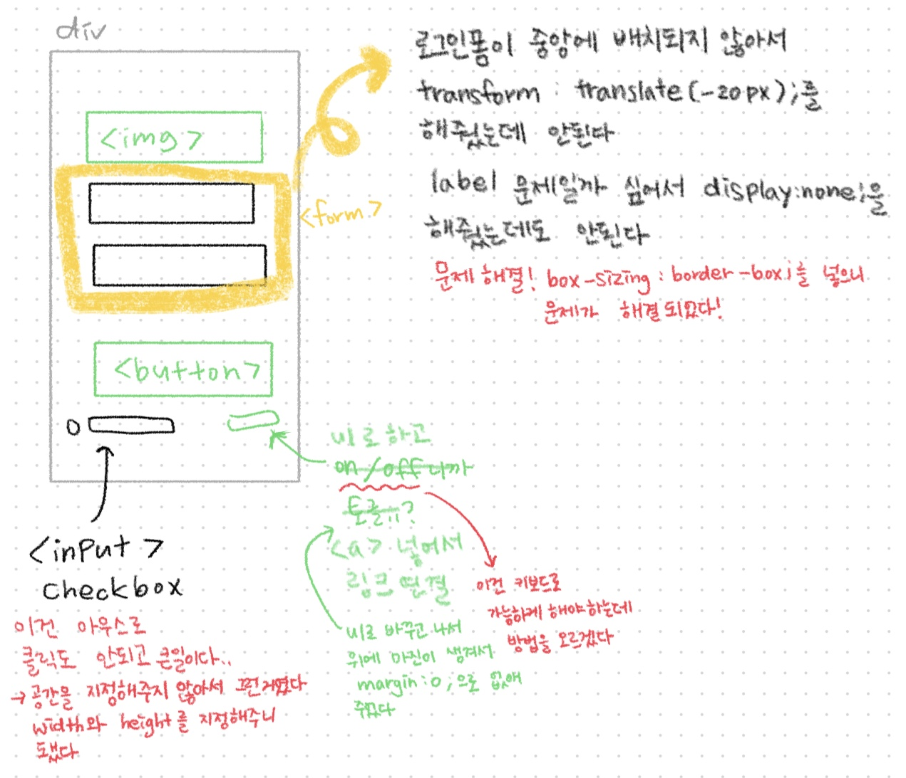
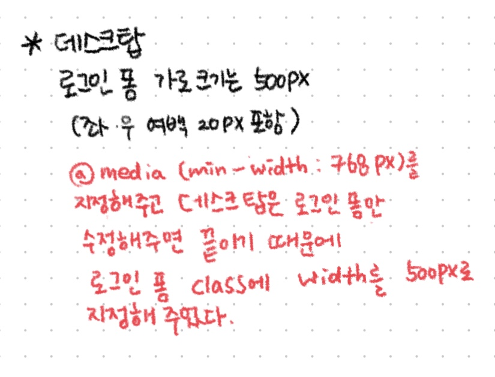

# NAVER 로그인 페이지 만들기!

이번 주 과제는 NAVER 로그인 페이지를 만드는 것이다!

만드는 과정에서 어려움은 크게 없었지만 중간에 내가 원하는 곳으로 배치가 안되어서 시간을 좀 잡아먹었다.
-----
## 주어진 조건!

이것 포함해서 데스크탑의 로그인 폼의 가로크기는 500px(좌,우 여백 20px 포함)이 있었다.

주어진 조건을 적고 하나씩 체크해가면서 빠진 건 없는지 확인하면서 과제를 풀어나갔다.

-----
## 과정!

제일먼저 UI를 그리고 중요한 것들을 따로 적어두었다.

그 다음은 마크업을 하기 위해 태그들을 적었고, 과제를 풀어가면서 발생한 문제들을 적었다. 

문제를 해결하는 내용들도 그 아래 적어서 해결 방법을 찾았다.

반응형으로 만들면서 데스크탑은 가로 너비만 정해두면 된다는 사실이 너무 행복했다.

